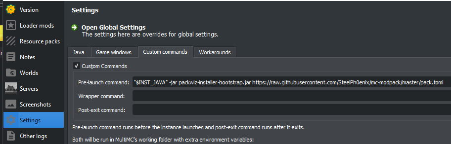

# SteelPh0enix's Minecraft 1.16.5 Modpack

Hello, this is my custom modpack for 1.16.5, based on Fabric. Basically, some QoL, technical, utility, blocks, and worldgen mods i've found around, with addition of some performance mods like Sodium, Phosphor and Lithium. It also features working shaders, thanks to [Iris](https://github.com/IrisShaders/Iris).

You need [packwiz installer](https://github.com/comp500/packwiz-installer-bootstrap/releases) to install this modpack. The instruction is below.

**This modpack (and repository) contains [BSL shaders by Capt Tatsu](https://bitslablab.com/bslshaders/). Make sure to activate them in graphics settings, for full experience (if your hardware can manage)!**

*I have a permission from Capt Tatsu to add his shaders here.*

## Modlist

### Technical

* **[Industrial Revolution](https://www.curseforge.com/minecraft/mc-mods/industrial-revolution)** - An industrial mod made for Fabric.
* **[Tech Reborn](https://www.curseforge.com/minecraft/mc-mods/techreborn)** - Tech Reborn is a completely standalone tech mod including tools and machines to gather resources.
* **[TIS-3D](https://www.curseforge.com/minecraft/mc-mods/tis-3d)** - Low-tech computing for Minecraft!

### Worldgen

* **[BetterEnd](https://www.curseforge.com/minecraft/mc-mods/betterend)** - This mod adds content to the End (biomes, mobs, blocks, etc.).
* **[BetterNether](https://www.curseforge.com/minecraft/mc-mods/betternether)** - Improvements for the Nether (plants, biomes, structures, worldgen).
* **[Cave Biomes](https://www.curseforge.com/minecraft/mc-mods/cave-biomes)** - Makes cave exploration more fun by adding over 25 new cave biomes!
* **[Mo' Structures](https://www.curseforge.com/minecraft/mc-mods/mo-structures)** - Mo' Structures is Fabric's best structure mod, adding new lore and adventure to your world!
* **[Repurposed Structures](https://www.curseforge.com/minecraft/mc-mods/repurposed-structures-fabric)** - Adds more variations of vanilla structures and features!
* **[Traverse](https://www.curseforge.com/minecraft/mc-mods/traverse)** - A biome expansion mod that embraces the simplistic nature of Minecraft biomes.

### Decorations, blocks

* **[Adorn](https://www.curseforge.com/minecraft/mc-mods/adorn)** - Decorate your home! Adds furniture and many other decoration blocks.
* **[Blockus](https://www.curseforge.com/minecraft/mc-mods/blockus)** - A mod that adds blocks!
* **[Mo' Colors](https://www.curseforge.com/minecraft/mc-mods/mo-colors)** - Dye wool, glass, slime, concrete, slime blocks and bricks any colors you want!
* **[Mo Glass](https://www.curseforge.com/minecraft/mc-mods/mo-glass)** - Adds glass stairs and glass slabs to Minecraft.

### Items, tools

* **[BLAST 💣](https://www.curseforge.com/minecraft/mc-mods/blast)** - A mod about bombs.
* **[Expanded Storage](https://www.curseforge.com/minecraft/mc-mods/expanded-storage-fabric)** - Similar to Iron Chests except allows chests to merge along all 3 axis.
* **[Extra Alchemy](https://www.curseforge.com/minecraft/mc-mods/extra-alchemy)** - A handful of Vanilla-friendly new potions.
* **[Fabric Furnaces](https://www.curseforge.com/minecraft/mc-mods/fabric-furnaces)** - A mod that adds more furnace versions to the game.
* **[Inmis](https://www.curseforge.com/minecraft/mc-mods/inmis)** - I need more inventory space! A backpack mod.
* **[Nature's Compass](https://www.curseforge.com/minecraft/mc-mods/natures-compass)** - Nature's Compass is a utility item that allows you to search for a biome's location.
* **[Netherite Plus Mod](https://www.curseforge.com/minecraft/mc-mods/netherite-plus-mod)** - Adds more netherite features to your game.
* **[Staff Of Building](https://www.curseforge.com/minecraft/mc-mods/staff-of-building)** - Adds in new staffs which can be used to speed up building.
* **[Vanilla Excavators](https://www.curseforge.com/minecraft/mc-mods/vanilla-excavators)** - Shovel alternative to Vanilla Hammers.
* **[Vanilla Hammers](https://www.curseforge.com/minecraft/mc-mods/vanilla-hammers)** - Adds a bunch of new hammers to the game!

### Utility

* **[AppleSkin](https://www.curseforge.com/minecraft/mc-mods/appleskin)** - Adds some useful information about food/hunger to the HUD.
* **[BetterF3](https://www.curseforge.com/minecraft/mc-mods/betterf3)** - A mod that provides a highly customizable, more human-readable Debug HUD.
* **[cAn i MiNe thIS bLOCk?](https://www.curseforge.com/minecraft/mc-mods/can-i-mine-this-block)** - This mod is for very smart people who need a mod to know if they can mine a block. *WTHIT addition.*
* **[CleanCut](https://www.curseforge.com/minecraft/mc-mods/cleancut)** - Attack enemies through obstructions!
* **[Compressed Blocks for Fabric](https://www.curseforge.com/minecraft/mc-mods/compressed-blocks-for-fabric)** - Adds compressed blocks to Minecraft.
* **[CraftPresence](https://www.curseforge.com/minecraft/mc-mods/craftpresence)** - Completely Customize the way others see you play in Discord!
* **[Diggus Maximus](https://www.curseforge.com/minecraft/mc-mods/diggus-maximus)** - Lightweight vein mining.
* **[Illuminations 🔥](https://www.curseforge.com/minecraft/mc-mods/illuminations)** - A client mod that adds fireflies and various glow-in-the-dark ambient particles to your world.
* **[Inventory HUD+](https://www.curseforge.com/minecraft/mc-mods/inventory-hud-forge)** - Adds your main inventory, potion effects and your equipments to your HUD.
* **[Inventory Sorting](https://www.curseforge.com/minecraft/mc-mods/inventory-sorting)** - Quick, simple, and lightweight inventory sorting.
* **[Iris Shaders](https://www.curseforge.com/minecraft/mc-mods/irisshaders)** - A new shaders mod for Minecraft intended to be compatible with existing ShadersMod/Optifine shaders.
* **[Lithium](https://www.curseforge.com/minecraft/mc-mods/lithium)** - An optimization mod for Minecraft which improves server performance significantly.
* **[megane](https://www.curseforge.com/minecraft/mc-mods/megane)** - HWYLA/WTHIT plugin that shows more tooltip than you'll ever want.
* **[Mod Menu](https://www.curseforge.com/minecraft/mc-mods/modmenu)** - Adds a mod menu to view the list of mods you have installed.
* **[Phosphor](https://www.curseforge.com/minecraft/mc-mods/phosphor)** - Performance improvements for Minecraft's lighting engine.
* **[Roughly Enough Items](https://www.curseforge.com/minecraft/mc-mods/roughly-enough-items)** - Clean and Customizable. An easy way to browse recipes.
* **[WTHIT](https://www.curseforge.com/minecraft/mc-mods/wthit)** - What the hell is that? A fork of Hwyla which is a fork of Waila.
* **[Xaero's Minimap](https://www.curseforge.com/minecraft/mc-mods/xaeros-minimap)** - Displays the nearby world terrain, players, mobs, entities in the corner of your screen.
* **[Xaero's World Map](https://www.curseforge.com/minecraft/mc-mods/xaeros-world-map)** - Adds a fullscreen worldmap which shows you what you have explored in the world.

## Libraries

* **[BCLib](https://www.curseforge.com/minecraft/mc-mods/bclib)** - A library mod for BetterX mods.
* **[Cloth API](https://www.curseforge.com/minecraft/mc-mods/cloth-api)** - Generalized API for Fabric.
* **[Cloth Config API](https://www.curseforge.com/minecraft/mc-mods/cloth-config)**  - Config Screen API for Fabric.
* **[Fabric API](https://www.curseforge.com/minecraft/mc-mods/fabric-api)** - Core API library for the Fabric toolchain.
* **[Fabric Language Kotlin](https://www.curseforge.com/minecraft/mc-mods/fabric-language-kotlin)** - Fabric language module for Kotlin.
* **[LibCapableData (LibCD)](https://www.curseforge.com/minecraft/mc-mods/libcd)** - Improved data processing.
* **[Reborn Core](https://www.curseforge.com/minecraft/mc-mods/reborncore)** - Powering Team Reborn.

## Installation guide
First, get [packwiz installer bootstrapper](https://github.com/comp500/packwiz-installer-bootstrap/releases) and put it in the same directory as your Minecraft **instance** (`.minecraft` or `minecraft` directory, depending on your OS)

Then, you have to open command-line in this directory, and run it with the direct URL to `pack.toml`. The command should look like this:

```bash
java -jar ./packwiz-installer-bootstrap.jar https://raw.githubusercontent.com/SteelPh0enix/mc-modpack/master/pack.toml
```

You should see a progressbar, and when it finishes you can run your Minecraft.

**If you're using a launcher that has an option to run pre-launch command** (like MultiMC), add this as pre-launch command so it'll be automatically ran before Minecraft to update/install new mods and other files.



The command-line for MultiMC will look like this:

```bash
"$INST_JAVA" -jar packwiz-installer-bootstrap.jar https://raw.githubusercontent.com/SteelPh0enix/mc-modpack/master/pack.toml
```

## Contributing

If you like this modpack, but you think it lacks some mods, feel free to put up a pull request, or DM me on Discord to add it: `SteelPh0enix#6969`
